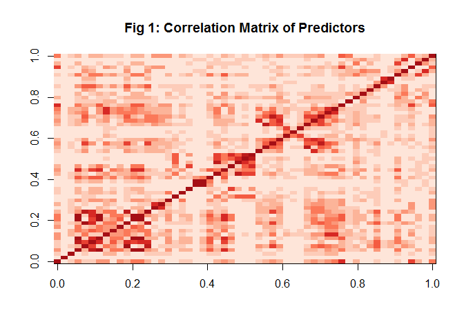
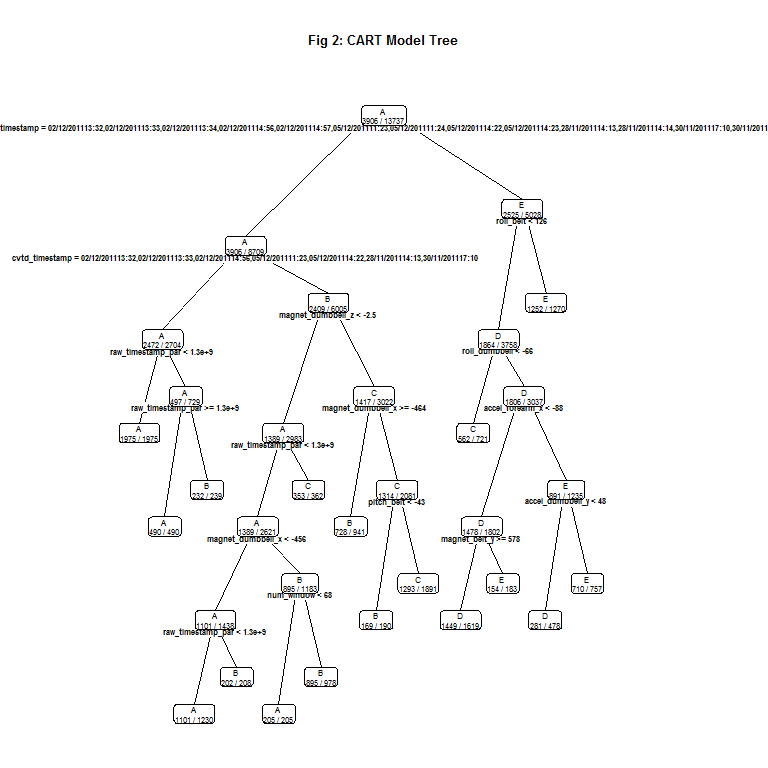
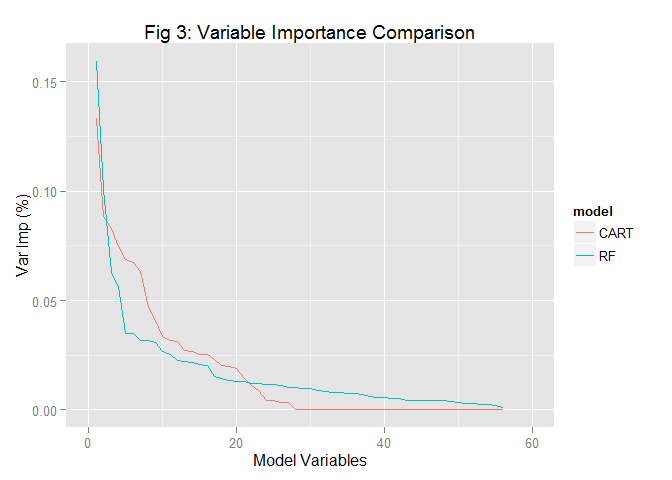

# Practical Machine Learning - Course Project : Predicting Quality of Weightlifting Exercise Method
Anirban Chatterjee  
Sunday, June 21, 2015  

This project is a required component of the Practical Machine Learning course from Johns Hopkins Bloomberg School of Public Health offered on Coursera.  
The project's primary purpose is to analyze sensor readings (on forearm, upper arm and waist) obtained at the time of execution of the weightlifting manoeuvre and develop a prediction algorithm to classify the manoeuvre.  
  

##1. Project Background - Original Research Details
The original research (from which the data used for the project is also drawn) was conducted by Velloso, E.; Bulling, A.; Gellersen, H.; Ugulino, W.; Fuks, H. and presented in Proceedings of 4th International Conference in Cooperation with SIGCHI (Augmented Human '13) . Stuttgart, Germany: ACM SIGCHI, 2013. Please refer to the original publication [here](http://groupware.les.inf.puc-rio.br/work.jsf?p1=11201).  
  
The researchers used the following 5 classes to label the accuracy of the exercise execution:  
- exactly according to specification (class A)  
- throwing the elbows to the front (class B)  
- lifting the dumbbell only halfway (class C)  
- lowering the dumbbell only halfway (class D)  
- throwing the hips to the front (class E)  
  
Readings were obtained from 6 healthy male participants in the age group 20-28 years with little weightlifting experience.  
All exercises were conducted under the supervision of an experienced weight lifter, with a relatively lightweight dumbbell (1.25 kg), to ensure easy compliance of participants to specified execution standards (list above).  
We will utilize the data obtained by the researchers to develop algorithms to predict the class of each observation, i.e., each execution of the weightlifting exercise, using the sensor readings for that observation.  
  

##2. Obtaining the data
We will use the dataset provided by the course instructor for our project. However, if the reader wishes to refer to the data published by the original researchers, please refer [here](http://groupware.les.inf.puc-rio.br/static/WLE/WearableComputing_weight_lifting_exercises_biceps_curl_variations.csv).  
But before we even read in the data, we need to set some global variables that will be referred throughout the code, and load all the required libraries.  


```r
setwd("F:/Coursera/Data Science/Machine Learning/Project")
train.url <- "https://d396qusza40orc.cloudfront.net/predmachlearn/pml-training.csv"
test.url <- "https://d396qusza40orc.cloudfront.net/predmachlearn/pml-testing.csv"
train.file <- "pml-training.csv"
test.file <- "pml-testing.csv"
answers.dir <- "answers"

# if a column has more NAs (as % of total rows) than this cutoff, it will be removed from the data
naPcnt.cutoff <- 0.5
# if two variables have higher correlation than this cutoff, it will be included in the highly
# correlated variables count
highCor.cutoff <- 0.8
# if a variable is highly correlated with more than the cutoff (% of total variables), it wil be
# removed from the data
highCorPcnt.cutoff <- 0.5

suppressPackageStartupMessages(library(rpart))
suppressPackageStartupMessages(library(rpart.plot))
suppressPackageStartupMessages(library(randomForest))
suppressPackageStartupMessages(library(caret))
suppressPackageStartupMessages(library(e1071))
suppressPackageStartupMessages(library(RColorBrewer))
suppressPackageStartupMessages(library(ggplot2))
```
  
Now we will test for the existence of the required csv files, and if not found, we will download them from the above links and load them into our R environment.  
We will then remove the identifier columns from the rest of the analysis. We believe that our models will be applied in a randomized, possibly blindfold setting and the IDs, even if they have marginal predictive power (i.e., if the same subject does multiple repeats of the exercise in the same flawed manner) should play no role in our analysis.  


```r
# check if the datasets exist, else download from the course site's location
if (!file.exists(train.file)) download.file(train.url, destfile=train.file)
if (!file.exists(test.file)) download.file(test.url, destfile=test.file)

# read the training and testing datasets
trainingData <- read.csv(train.file, na.strings=c("", "NA", "#DIV/0!"))
testingData <- read.csv(test.file, na.strings=c("", "NA", "#DIV/0!"))

# remove the id and subject name columns - they do not have any predictive power
trainingData <- trainingData[, -c(1:2)]
testingData <- testingData[, -c(1:2)]

cat(paste0("Records in training set = ", nrow(trainingData), ", in testing set = ",
           nrow(testingData)))
```

```
## Records in training set = 19622, in testing set = 20
```
  
  
##3. Data Cleaning / Variable Selection
We start the analysis with splitting the training data into 2 parts, one for model building and another for out-of-sample testing/validation. We choose a 70:30 split for model development and validation.  


```r
# subset the training data into two parts - one to build the model and another for out-of-sample
# testing
set.seed(101)
subsetTrain <- createDataPartition(y=trainingData$classe, p=0.7, list=FALSE)
trainTrain <- trainingData[subsetTrain,]
testTrain <- trainingData[-subsetTrain,]
```
  
We will execute the following steps in order to transform the data and remove variables that have little to no predictive power for the problem we are analyzing:  
1. remove variables with high percentage of NA  
2. remove variables with very low variance  
3. remove variables that are highly corrleated with too many other variables (excluding the timestamp variable from this filtering step)  


```r
# remove columns with very high % of NA values
trainTrain.Response <- trainTrain[, 158]
trainTrain <- trainTrain[, -158]
trainTrain.NA <-
    data.frame(col.names = colnames(trainTrain),
                na.pcnt = apply(trainTrain, 2, FUN=function(x) {sum(is.na(x))/length(x)}),
                row.names=NULL)
trainTrain <-
    trainTrain[, as.character(trainTrain.NA[trainTrain.NA$na.pcnt < naPcnt.cutoff,1])]

# remove columns with very low variability - will have little or no predictive power
nzvVars <- nearZeroVar(trainTrain)
if (length(nzvVars) > 0) trainTrain <- trainTrain[, -nzvVars]
```
  
We would also like to display graphically the correlation matrix of the variables after the first 2 filtering steps to give the reader an idea of possible clusters of correlated variables.  
This line of thought can be explored further by incorporating a clustering algorithm on the variables for further fine-tuning of the prediction models and making them more robust to out-of-sample data.  


```r
cvtd_timestamp <- trainTrain[, 3]
train.VarCor <- 
    data.frame(colNames = colnames(trainTrain[, -3]),
                highCor.pcnt = apply(cor(trainTrain[, -3]), 2,
                                FUN=function(x) {sum(abs(x) >= highCor.cutoff)/length(x)}),
                row.names=NULL)
corPal <- colorRampPalette(brewer.pal(5, "Reds"))
image(abs(cor(trainTrain[, -3])), col=corPal(10))
title(main="Fig 1: Correlation Matrix of Predictors")
```



```r
trainTrain <- trainTrain[,
            as.character(train.VarCor[train.VarCor$highCor.pcnt < highCorPcnt.cutoff, 1])]
trainTrain$cvtd_timestamp <- cvtd_timestamp

cat(paste0("Records used to build model = ", nrow(trainTrain), ", records used to validate model = ", nrow(testTrain)))
```

```
## Records used to build model = 13737, records used to validate model = 5885
```

```r
cat("Variables used to build the model =", ncol(trainTrain))
```

```
## Variables used to build the model = 56
```
  
Please note that darker colors represent higher correlation in the above plot.  
Now we are left with 56 variables, and we have not made any transformations at the observation-level, i.e., all our rows are identical to the original data.  
  

##4. Building Prediction Models
We will start with a standard CART model, and gradually increase the complexity of the model algorithm to obtain better prediction accuracy on the testing data derived from splitting the training data.  

###4.1 CART Model
We will build the model, show the reader a plot of how the model progressively splits the data and conclude the section with the accuracy obtained on the out-of-sample data.  


```r
trainCART <- rpart(trainTrain.Response ~ ., data=trainTrain, method="class",
                   control=rpart.control(cp=0.01, xval=10))
rpart.plot(trainCART, type=2, extra=2, space=0.4, cex=0.5, main="Fig 2: CART Model Tree")
```

 

```r
confusionMatrix(testTrain$classe, predict(trainCART, testTrain, type="class"))
```

```
## Confusion Matrix and Statistics
## 
##           Reference
## Prediction    A    B    C    D    E
##          A 1609   46   19    0    0
##          B   50  921  158   10    0
##          C    1   59  950   16    0
##          D    2   53  174  687   48
##          E    0    0   43  123  916
## 
## Overall Statistics
##                                           
##                Accuracy : 0.8637          
##                  95% CI : (0.8547, 0.8724)
##     No Information Rate : 0.2824          
##     P-Value [Acc > NIR] : < 2.2e-16       
##                                           
##                   Kappa : 0.8277          
##  Mcnemar's Test P-Value : NA              
## 
## Statistics by Class:
## 
##                      Class: A Class: B Class: C Class: D Class: E
## Sensitivity            0.9681   0.8536   0.7068   0.8218   0.9502
## Specificity            0.9846   0.9546   0.9833   0.9451   0.9663
## Pos Pred Value         0.9612   0.8086   0.9259   0.7127   0.8466
## Neg Pred Value         0.9874   0.9667   0.9189   0.9697   0.9900
## Prevalence             0.2824   0.1833   0.2284   0.1421   0.1638
## Detection Rate         0.2734   0.1565   0.1614   0.1167   0.1556
## Detection Prevalence   0.2845   0.1935   0.1743   0.1638   0.1839
## Balanced Accuracy      0.9764   0.9041   0.8451   0.8835   0.9582
```
  
As you can see, this model yields an out-of-sample accuracy of 86.37%, and we believe this result to hold good for any other randomized new data thrown at the model. Our faith stems from the 10-fold cross validation we have used in the model building step.  
But, we belive we can still improve on this accuracy.  

###4.2 Random Forest Model
We will build a random forest model with all the 56 significant variables included. We will use the default parameters (ntree = 500) because we believe that will provide sufficient robustness and stability to the forest grown by the method.  
We will present the out-of-sample accuracy as the conclusion of this section.  


```r
trainRF <- randomForest(trainTrain.Response ~ ., data=trainTrain)
confusionMatrix(testTrain$classe, predict(trainRF, testTrain, type="class"))
```

```
## Confusion Matrix and Statistics
## 
##           Reference
## Prediction    A    B    C    D    E
##          A 1674    0    0    0    0
##          B    0 1139    0    0    0
##          C    0    1 1024    1    0
##          D    0    0    1  961    2
##          E    0    0    0    3 1079
## 
## Overall Statistics
##                                           
##                Accuracy : 0.9986          
##                  95% CI : (0.9973, 0.9994)
##     No Information Rate : 0.2845          
##     P-Value [Acc > NIR] : < 2.2e-16       
##                                           
##                   Kappa : 0.9983          
##  Mcnemar's Test P-Value : NA              
## 
## Statistics by Class:
## 
##                      Class: A Class: B Class: C Class: D Class: E
## Sensitivity            1.0000   0.9991   0.9990   0.9959   0.9981
## Specificity            1.0000   1.0000   0.9996   0.9994   0.9994
## Pos Pred Value         1.0000   1.0000   0.9981   0.9969   0.9972
## Neg Pred Value         1.0000   0.9998   0.9998   0.9992   0.9996
## Prevalence             0.2845   0.1937   0.1742   0.1640   0.1837
## Detection Rate         0.2845   0.1935   0.1740   0.1633   0.1833
## Detection Prevalence   0.2845   0.1935   0.1743   0.1638   0.1839
## Balanced Accuracy      1.0000   0.9996   0.9993   0.9976   0.9988
```
  
This approach gives us a whopping 99.86% accuracy!  
Only 8 observations were misclassified by the model in the out-of-sample testing data (derived by splitting the original training data). We can investigate the nature of these points in more detail, but given the volume of data in both training and testing sets, it would not provide incremental benefit in manually revising the splitting rules generated by the model.  

###4.3 Explaining the accuracy gain in RF over CART
We will use variable importances in the two models to compare their robustness and show that RF, by using a larger set of variables to split the branches, achieves significantly higher accuracy.  


```r
varImpCART <- data.frame(model = "CART", varNames = rownames(varImp(trainCART)),
                         varImp(trainCART)/sum(varImp(trainCART)), row.names=NULL)
varImpRF <- data.frame(model = "RF", varNames = rownames(varImp(trainRF)),
                       varImp(trainRF)/sum(varImp(trainRF)), row.names=NULL)
varImps <- rbind(varImpCART, varImpRF)
varImps <- varImps[order(varImps$model, -varImps$Overall),]
varImps$varNum <- rep(1:ncol(trainTrain), times=2)

g <- ggplot(data=varImps, aes(x=varNum)) + geom_line(aes(y=Overall, color=model))
g <- g + xlim(c(0, ifelse(round(nrow(varImps)/2,-1) > nrow(varImps)/2, round(nrow(varImps)/2,-1),
                          round(nrow(varImps)/2,-1) + 10)))
g <- g+xlab("Model Variables")+ylab("Var Imp (%)")+ggtitle("Fig 3: Variable Importance Comparison")
g
```


  
As can be seen from the plot, RF uses all the variables to cut the data (none of the variables have 0 importance), while CART uses only about 50% of the variables. This results in CART missing out several micro-structures in the data that would have otherwise improved the homogeniety of the leaf nodes.  
  

##5. Test-set Prediction & Final Submission
We will use the RF model to predict on the testing set and create individual output files containing the prediction for each testing set observation separately.  
Important point to note before running the prediction on the test set - set the levels of the factor variables "cvtd_timestamp" and "new_window" in the testing set to be equal to that of the training set. This is required fo predict.randomForest function to work correctly.  


```r
levels(testingData$cvtd_timestamp) <- levels(trainingData$cvtd_timestamp)
levels(testingData$new_window) <- levels(trainingData$new_window)
answers <- predict(trainRF, testingData, type="class")

# create the output folder, if it doesn't exist, and create individual files for each record in the
# testing data for final submission
if(!file.exists(answers.dir)) dir.create(answers.dir)
for(i in 1:length(answers)) {
    answer.out.file <- paste0(answers.dir, "/", colnames(testingData)[158], "_", i, ".txt")
    write.table(answers[i], file = answer.out.file, quote=FALSE, row.names=FALSE, col.names=FALSE)
}
```
  
  
This concludes the course project for the Practical Machine Learning course on Coursera.  
Thanks for your time and patience in going through the material!  
